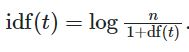
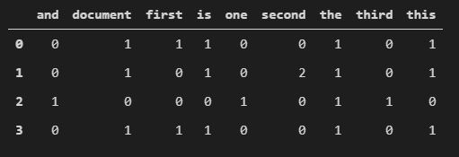

# tweet-classification
 
### **What is TFIDF?**
- Since machine learning algorithms deal with numbers, text data needs to be transformed into numbers. This process is known as text vectorization.  
- The simplest way to perform text vectorization is to simply create a vector for each data sample that counts the frequency of each word in the entire dataset.  
- This method is called Count Vectorization, the problem with it is that it can't identify words that are more or less important for analysis. It just considers more frequent words as the most statistically significant word.

Term Frequency - Inverse Document Frequency or TF-IDF solves this problem by providing a numerical representation of the importance of a given word for statistical analysis. 
- TF-IDF measures how relevant a word is by using two metrics:  
  - Term Frequency - How many times does a word appear in a given sample?
  - Inverse Document Frequency - Where document frequency measures how many times does a word appear in the entire set of samples.
- As a result, words that are too common or too rare in the corpus are penalized by giving them lower TF-IDF scores.
- TFIDF is calculated as:  
  - tfidf(t,d,D) = tf(t,d) * idf(t,D)  
  - Where tf(t,d) represents the frequency of a term in a document and  
    idf(t,D) represents the frequency of a term in the entire set of documents  
- tf(t,d) and idf(t,D) can be weighted in various different ways. The sklearn implementation just uses the number of times a term occurs in a document for tf, without weighting. While idf(t,D) is calculated as:  
  - 
- This differs from the standard definition of idf:  
  - 
- The 1 is added to the denominator to ensure that log(0) isn't calculated for a completely new term. 

To compare TF-IDF and Count Vectorizer, we can take a basic example.  
- Say a document has the following 2 sentences:  

- If we perform count vectorization we get the following matrix:  

- If we perform tfidf vectorization we get the following matrix:  

- As we can see, tfidf vectorization gives us more information as compared to the Count Vectorization.  
- It is important to note that tf-idf values for small text corpuses are likely to be noisy.

### **Difference between Stemming and Lemmatization** 
- Stemming and Lemmatization are used to find the "stem" or "root" of a given word.
- In a given corpus, for grammatical reasons, a word might be used in its many different forms. For example: eat, eaten, eating, eats, ate etc.
- Stemming and Lemmatization is performed so that these words aren't treated as completely different words.
- Stemming algorithms follow a specific set of rules and cut off suffixes from the beginning or end of the word to reach the "stem" words. For example Studies and studying are both stemmed to studi.
- Lemmatization is a more complicated process and it involves an actual morphological analysis of the word. It returns the base or dictionary form of a word called a lemma.
- For example in case of the word "saw" a stemmer might return just "s" or "saw" as is, but a lemmatizer will return "saw" or "see based on whether it was used in the context as a noun or a verb.
- As a result, lemmatization tends to be more accurate and better conveys what the word could mean but it is also more computationally expensive.
- Therefore in tasks where accuracy is more important, lemmatization usually performs better.
- But in some cases such as indexing a massive number of documents in a search engine, stemming might be preferred as it is much faster, and much easier to implement.
- The difference between the two can be seen in the following image:

- As we can see, lemmatization tries to maintain more information while stemming fails to notice that "United States" is a proper noun.

### Basic model with just TF-IDF vectorization  
Two models were made with just TF-IDF vectorization
- First model set a limit on the vector length=length of longest sentence in the training data.
  - It had an accuracy of 68% on the test set
  - 
  - 
  - As we can see accuracy on the test set and training set remains around the same after the 5th epoch without any major spikes.
- In the 2nd model,no limit was set on the vector length and the model was allowed to create vectors for all words in the vocabulary
  - It had an accuracy of 83.8% on the test set 
  - 
  - 
  - As we can see, training accuracy keeps increasing while accuracy on test set remains the same. This overfitting can be fixed through early stopping.
  
### Model with TF-IDF weighted embedding
- Another model is made where TF-IDF vectors are generated for the data.
- The GloVe vectors for all TF-IDF terms are obtained using spacy
- The TF-IDF vectors are multiplied by the GloVe vectors for those TF-IDF terms to obtain TF-IDF weighted embeddings for the data
- It had an accuracy of 72.1% on the test set
- 
- 

### Model with tensorflow vectorization and embedding
The first model uses tensorflow's TextVectorization and Embedding layers
- This requires the addition of a 1D pooling layer to reduce the dimensionality of embedded data
- The model has an accuracy of 83%
- 
- 
- As we can see, training accuracy keeps increasing while accuracy on test set remains the same. This overfitting can be fixed through early stopping  

The second model makes use of early stopping
- An additional early stopping callback is added 
- This model stops training after the 5th epoch
- This model has an accuracy of 84%
- 
- 

### **LSTM**
- Since tweets tend to be short and discuss a wide variety of topics, it's difficult to obtain a lot of useful features for classification using normal text vectorization, embeddings or TF-IDF models.
- As a result it might be better if a feature can be involved in many possible inputs.
- This guides us towards RNNs since an RNN can learn from the current input as well as previous inputs.
- But RNNs have a known downside, i.e. they suffer from vanishing gradient problem resulting in a shorter memory.
- **This short term memory problem is resolved using LSTMs**
- LSTMs have an additional signal called "cell memory".
- This cell memory allows the LSTM to decide whether certain features should be passed ahead to the next cell or they should be forgotten.
- It uses a gate mechanism to overcome the problem of the vanishing gradient.
- Gates are way to optionally let information through to the cell and consist of smaller neural nets with either sigmoid or tanh as the activation function.
- An LSTM Unit at time t looks like:  
  
- The input gate decides what new information is going to be stored in the cell state
- The forget gate determines what features are no longer needed and can be forgotten
- The output gate passes the final output of the cell and the information being sent ahead

### **LSTM Model**
An LSTM model is made with a 50 unit LSTM layer after the embedding layer
- 1D Pooling layer is removed as LSTM layer expects 3 dimensional data
- The accuracy of the resulting model is 83%
- 
- 
- As we can see, the model reaches 100% accuracy on the training data almost immediately

### **Notes**
- The same random state(7) is taken for all train-test splits to ensure that the same data is used for training and testing in all notebooks
- The accuracy of models seems to peak at 84%